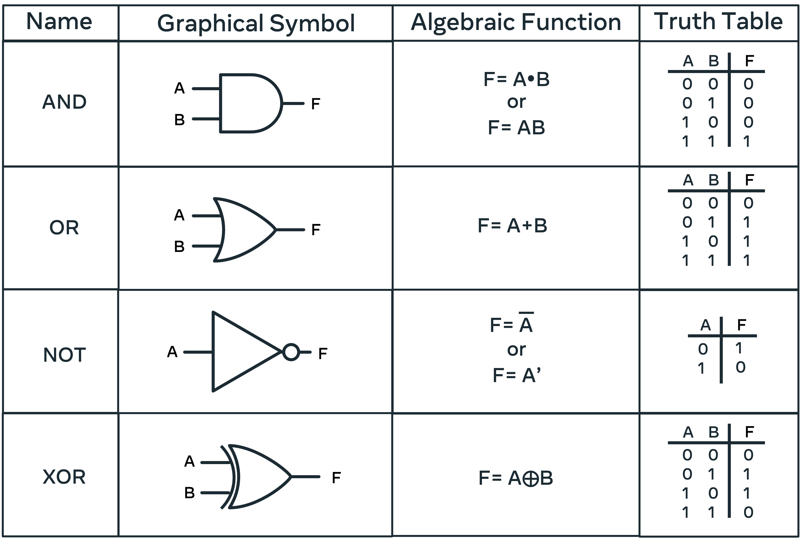

__optimizing your code:__
- To optimize space complexity, you may opt for a solution that does in-place changes over creating a new data structure to house the result
- Avoid excessive compiler calls. If you are searching for a value in an array, terminate the loop when the item is found. 
- Modularize this code into a function that is callable repeatedly and reuse the code when possible.
- If there are portions of your code that are no longer required as a result of modularizing, or as a result of an avenue of thought that was not completed, remove it

### deal with technical question:
__STAR method:__
- Situation: project and challenges you faced (the context)
- Task: your responsibilities and assignments
- Action: what you did to solve the problem
- Result: the outcome of your actions

__MEMORY:__
- CPU(Central unit processing) is the brain of the computer. It is responsible for executing instructions and processing data. It is the most important component of a computer system.
- Cache memory is a small amount of memory that is a part of the CPU. It is used to store frequently accessed data and instructions to speed up the processing. Most expensive form, fastest and closest to the CPU.
- Main memory consists of read/random access memory, RAM and read only memory, ROM.

When the CPU receives an instruction to process some information, it first checks the cache to see if the information is here. If the information is available in the cache, it is processed, if it fails to find the required information here, the information is not processed. The CPU then queries the larger, slower main memory then loads this information into the cache for processing.

ROM is busiest when the computer starts and information on the required application is loaded. RAM is programmable, it can retain new information and instructions. RAM holds the current data and instructions that are in current use. The amount of RAM your computer has is directly correlated to how fast it can go. This is because of the transfer rate. Large amounts of RAM mean that the system does not need to transfer information constantly. Instead it can hold and run a number of applications at once using RAM. All the memory needed to operate these applications needs to be available from your RAM. Having too many programs open will affect the performance of your system by exhausting your RAM memory.

- Secondary memory relates to external memory that can be plugged in externally and used to increase the storage capacity of your system.   Accessing this type of memory is slower and requires transferring all required information and instructions into RAM. Examples of secondary memory include hard drives, USB drives, and CDs.
- RAM is volatile memory, meaning that it is lost when the computer is turned off.
- Secondary memory is non-volatile, meaning that it is retained when the computer is turned off.

__Binary:__  

### Basic data structures

__Lists and sets:__  

__Lists:__
In most programming languages, lists are represented as objects. This means that in addition to storing data, they also have their own in-built methods. These methods can be used to manipulate the data stored in the list. e.g. append, insert, remove, pop, sort, reverse, index, count, extend, copy, clear. 

it can be `array` or `linked list.`. With `array` you can access any element in the list in constant time(O(1)). `linked list` is a data structure that consists of a sequence of nodes. Each node is composed of two elements: `data` and `poiter`: a reference to the next node in the sequence. The last node has a reference to null. The entry point into a linked list is called the head of the list. It should be noted that the head is not a separate node, but the reference to the first node. If the list is empty then the head is a null reference. A linked list is a dynamic data structure. The number of nodes in a list is not fixed and can grow and shrink on demand. Any application which has to deal with an unknown number of objects will need to use a linked list.

__Sets:__
A set is an unordered collection of items. Every element is unique (no duplicates) and must be immutable (which cannot be changed). However, the set itself is mutable. We can add or remove items from it. Sets can be used to perform mathematical set operations like union, intersection, symmetric difference etc.

its fast to search cuz it uses `hash function` O(1). Hash function is any function that can be used to map data of arbitrary size to fixed-size values.

__stacks and queues:__  
Stacks and queues are two data structures that are used to store data in a particular order. The main difference between a stack and a queue is that a stack is a LIFO structure (last in, first out), while a queue is a FIFO structure (first in, first out).

Some of the methods that are used to manipulate stacks and queues are: push, pop, peek, enqueue, dequeue, isEmpty, isFull.

__trees:__  
A tree is a data structure that consists of nodes connected by edges. Each node has a parent node and zero or more children nodes. The topmost node in the tree is called the root of the tree. The height of a tree is the length of the longest path to a leaf. The depth of a node is the length of the path to its root. A tree is a recursive data structure. A tree is a recursive data structure because a tree can be defined as a collection of nodes (starting at a root node), where each node is a data structure consisting of a value, together with a list of references to nodes (the "children"), with the constraints that no reference is duplicated, and none points to the root.

Some types of trees are: `binary tree`, `binary search tree`, `AVL tree`, red-black tree, B-tree, B+ tree, splay tree, treap, trie, radix tree, suffix tree, segment tree, k-d tree, k-ary tree, n-ary tree, and more.

searching a tree: DFS( Depth-first search) and BFS(Breadth-first search).

A binary tree has the following properties: 

1. Every node has a maximum of two child nodes.
2. Every node must have a key so that it can be easily identified.
3. Values found to be less than the node are placed in the left child node, and values that are greater are placed in the right child node.

__Hash tables:__  
A hash table is a data structure that maps keys to values for highly efficient lookup. There are two main components of a hash table: an array and a hash function. The array is used to store the data elements, while the hash function is used to convert the key into an array index. The hash function is designed to return the index of the array element where the value should be stored. Hash tables are used to implement `map` and `sets` data structures in many common programming languages.
Some hash algorithms are: `MD5`, `SHA-1`, `SHA-2`, `SHA-3`, ...

`HashMap` allows one null key and multiple null values whereas Hashtable doesn't allow any null key or value. HashMap is generally preferred over HashTable if thread synchronization is not needed.

`synchronization` is the capability to control the access of `multiple threads` to any shared resource at the same time. Without synchronization, it is possible for one thread to modify a shared object while another thread is in the process of using or updating that object's value. This often leads to significant errors.

__Heaps:__  
A heap is a tree-based data structure in which all the nodes of the tree are in a specific order. There can be two types of heaps: `max heap` or `min heap`. In a max heap, the key present at the root node must be the greatest among all the keys present at all of the nodes of the tree. The same rule must be recursively true for all sub-trees in that Binary Tree. The node at the top of the heap with no parents is called the root node. The heap is always a complete binary tree. A complete binary tree is a binary tree in which all the levels of the tree are fully filled, except possibly the last level. To build a heap, we can use an array. The root element will be at Arr[0]. Below table shows indexes of other nodes for the ith node, i.e., Arr[i]:

img above is a binary tree

some methods that are used to manipulate heaps are: `insert`, `delete`, `extractMax`, `extractMin`, `getMax`, `getMin`, `heapify`, `heapSort`.

The main difference between a heap and a binary search tree is that the heap is designed to optimize the retrieval of the maximum or minimum element in the tree, while a binary search tree is designed to optimize searching a particular element in the tree.

__Graphs:__  
A graph is a data structure that consists of a finite set of nodes (or vertices) and a set of edges connecting these nodes. A pair (x,y) is referred to as an edge, which communicates that the x vertex connects to the y vertex. The set of edges describes the connectivity of the graph. A graph is a collection of vertices and edges. A graph is represented using a set of vertices, V, and a set of edges, E. Each edge is a pair (v,w) where v,w ∈ V. The pair is ordered when the graph is directed, and unordered when the graph is undirected. A graph can be represented using an adjacency matrix or an adjacency list.

-> shortest path: Dijkstra's algorithm, Bellman-Ford algorithm, Floyd-Warshall algorithm, Johnson's algorithm, A* search algorithm, breadth-first search, depth-first search, ...

