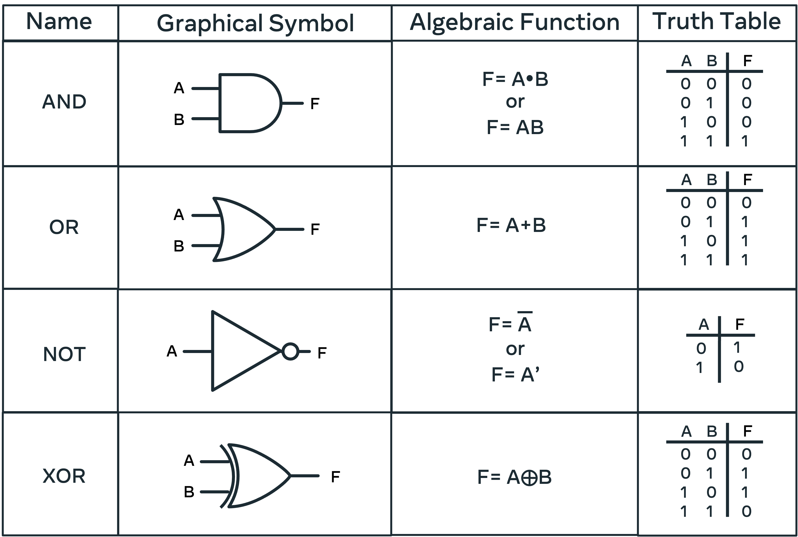
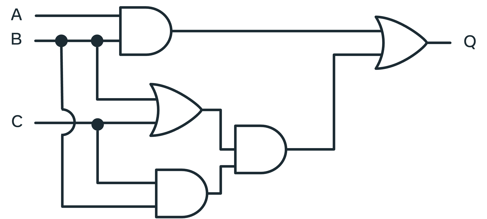

__optimizing your code:__
- To optimize space complexity, you may opt for a solution that does in-place changes over creating a new data structure to house the result
- Avoid excessive compiler calls. If you are searching for a value in an array, terminate the loop when the item is found. 
- Modularize this code into a function that is callable repeatedly and reuse the code when possible.
- If there are portions of your code that are no longer required as a result of modularizing, or as a result of an avenue of thought that was not completed, remove it

### deal with technical question:
__STAR method:__
- Situation: project and challenges you faced (the context)
- Task: your responsibilities and assignments
- Action: what you did to solve the problem
- Result: the outcome of your actions

__MEMORY:__
- CPU(Central unit processing) is the brain of the computer. It is responsible for executing instructions and processing data. It is the most important component of a computer system.
- Cache memory is a small amount of memory that is a part of the CPU. It is used to store frequently accessed data and instructions to speed up the processing. Most expensive form, fastest and closest to the CPU.
- Main memory consists of read/random access memory, RAM and read only memory, ROM.

When the CPU receives an instruction to process some information, it first checks the cache to see if the information is here. If the information is available in the cache, it is processed, if it fails to find the required information here, the information is not processed. The CPU then queries the larger, slower main memory then loads this information into the cache for processing.

ROM is busiest when the computer starts and information on the required application is loaded. RAM is programmable, it can retain new information and instructions. RAM holds the current data and instructions that are in current use. The amount of RAM your computer has is directly correlated to how fast it can go. This is because of the transfer rate. Large amounts of RAM mean that the system does not need to transfer information constantly. Instead it can hold and run a number of applications at once using RAM. All the memory needed to operate these applications needs to be available from your RAM. Having too many programs open will affect the performance of your system by exhausting your RAM memory.

- Secondary memory relates to external memory that can be plugged in externally and used to increase the storage capacity of your system.   Accessing this type of memory is slower and requires transferring all required information and instructions into RAM. Examples of secondary memory include hard drives, USB drives, and CDs.
- RAM is volatile memory, meaning that it is lost when the computer is turned off.
- Secondary memory is non-volatile, meaning that it is retained when the computer is turned off.

__Binary:__  

