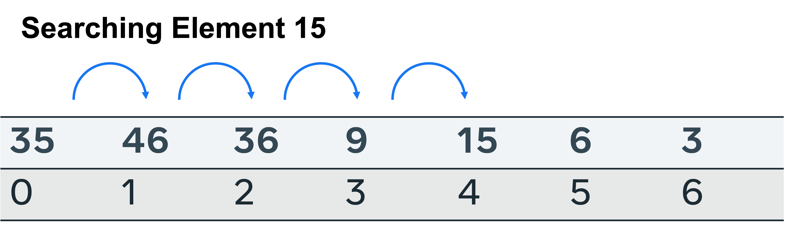
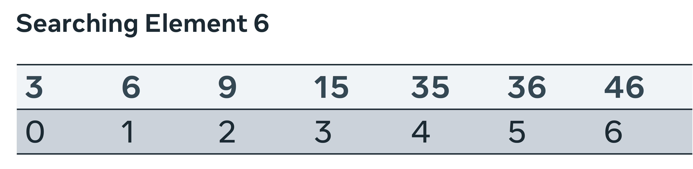
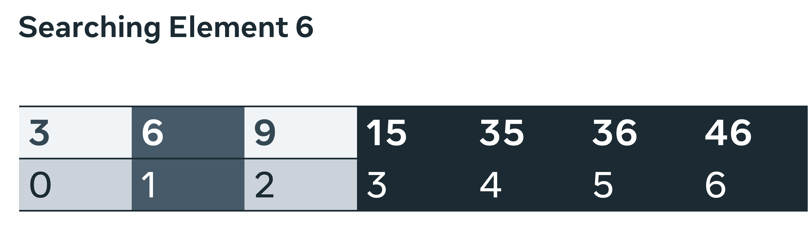

## Time and space complexity in search algorithms
In this reading, you will explore time and space complexity in both linear and binary searching algorithms. To gain a greater sense of how time and space complexity feature, these two searches are examined noting the time and space used in finding the target element. 

__Linear search__  
A linear search is the most direct way of retrieving an item. It means that the search starts at the first item and iterates until either the target item is found or there are no more items left in the array to check.

Given a list of numbers, start at index location 0 and compare each item with a target variable. Return when the index location has been determined or the entire list has been checked and there is no instance of the target element.

These are the outcomes to consider when evaluating the efficacy of the search. 

- Worst case: The item is absent from the list. To determine this, every possible location in the list size n has to be searched. `O(n)` time complexity.

- Average case: The element is found in the middle. This is considered an outcome of `O(n)`.

- Best case: The item is found at the starting index and no further checks are required, so `O(1)`.

- Space complexity: No additional space is required to perform the search. So, the space required will only be as large as the items that have to be stored in the list, space complexity `O(n)`.

__Binary search__  
A binary search is performed by first identifying the mid-point on a sorted list, comparing the target element to it and discarding the half that is less than the target element. This halving at the mid-point is repeated until the target element is found or there is no more list to half. 

To conduct a binary search, the list must first be sorted. 

First, a middle point is selected. The value at index 3, is 15. Is this greater than or less than the target element? The search space is broken in two and the left is further examined. 

A new central point is selected. This time there are only three slots to check; index location 1 is at the halfway point. 

The target value is found here and no further splits are required. 

These are the outcomes to consider when evaluating the efficacy of the search: 

- Worst case: The item is absent from the list. Due to the nature of the approach, many items are removed with the use of the logical operators greater than and less than. This means that only n/2 is checked first, then n/4 and n/8. The overall complexity is then O(log N).  

- Average case: The element is found after several iterations. Again due to the search mechanism, each subsequent call reduces the state space. So, it can be determined that after a medium number of searches, the complexity is O(Log N). 

- Best case: The item is found at the starting index and no further checks are required, so O(1).

- Space complexity: No additional space is required to perform the search. So, the space required will only be as large as the items to be stored in the list, space complexity O(n).

__Conclusion__  
In this reading, you explored time and space complexity in both linear and binary searching algorithms. The time and space complexity for linear and binary search has been analyzed. Both approaches are in-place searches; therefore, there is no additional space required, so the space complexity is small. Linear search has shown itself to be more time complex in all instances, other than the correct item being found on the first attempt.

Binary search halves the state space at every iteration, making it far more efficient. However, you should consider factoring the time taken to sort the array in the overall calculations when evaluating the efficacy of selecting this approach for a general application. 
